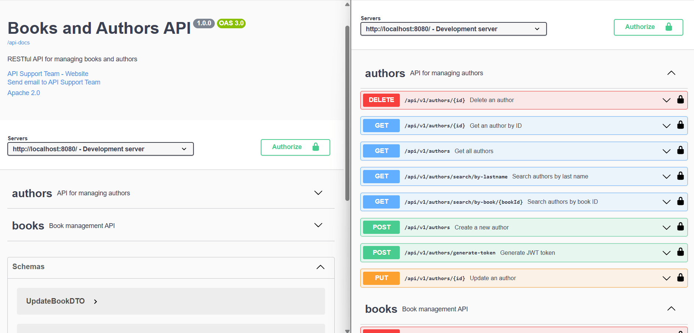
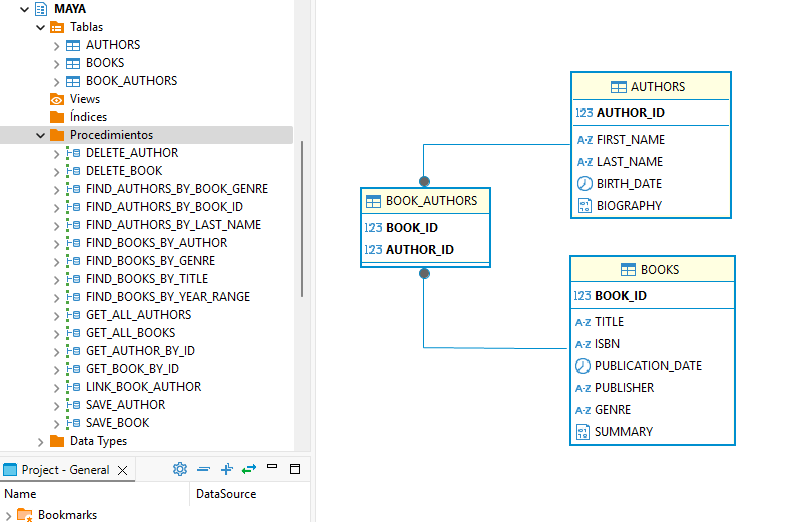
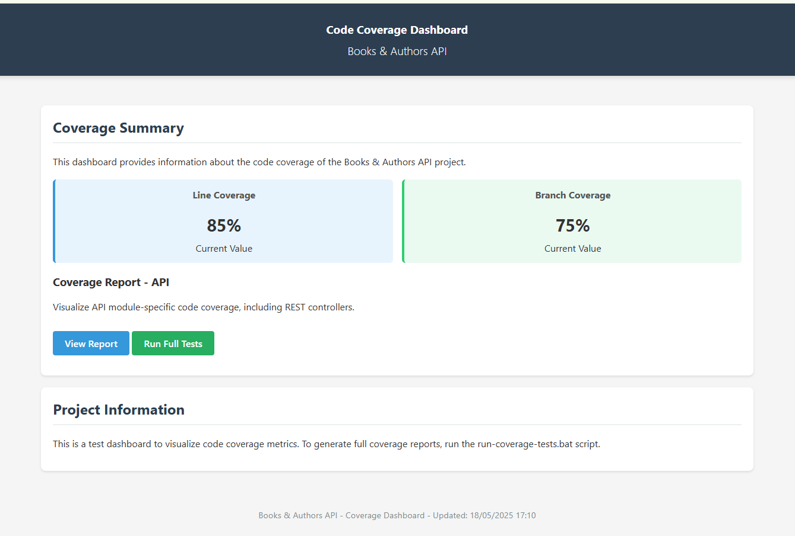

# Books and Authors API
<p align="center">
  
</p>
  <p align="center">
  
A RESTful API for managing books and authors with a Java, Spring Boot, and PL/SQL backend.</p>
<p align="center">
  <a href="https://www.java.com" target="_blank"></a>
  <a href="https://spring.io/" target="_blank"></a>
  <a href="https://maven.apache.org/" target="_blank"></a>
  <a href="https://www.oracle.com/database/" target="_blank"></a>
  <a href="https://springdoc.org/" target="_blank"></a>
  <a href="https://www.docker.com/" target="_blank"></a>
  <a href="https://projectlombok.org/" target="_blank"></a>
  <a href="https://mapstruct.org/" target="_blank"></a>
  <a href="https://junit.org/junit5/" target="_blank"></a>
  <a href="https://site.mockito.org" target="_blank"></a>
  <a href="https://github.com/jwtk/jjwt" target="_blank"></a>
  <a href="https://github.com/FasterXML/jackson" target="_blank"></a>
  <a href="https://h2database.com/" target="_blank"></a>
  <a href="https://www.slf4j.org/" target="_blank"></a>
  <a href="https://logback.qos.ch/" target="_blank"></a>
  <a href="https://www.apache.org/licenses/LICENSE-2.0" target="_blank"></a>
</p>

## Project Architecture

This project follows a clean hexagonal architecture with the following modules:

- **domain**: Contains the business entities, value objects, and repository interfaces
- **infrastructure**: Contains the implementation of repository interfaces, database configuration, and external services
- **application**: Contains the business logic, use cases, and service implementations
- **api**: Contains the REST controllers, DTOs, and API configuration

## Technology Stack

- Java 17
- Spring Boot 3.2.0
- Maven (multi-module project)
- Oracle Database con PL/SQL
- Oracle JDBC Driver 23.3.0.23.09
- OpenAPI (springdoc-openapi) 2.2.0 for API documentation
- JUnit 5.10.1 y Mockito 5.7.0 for testing
- Docker y Docker Compose for containerization
- MapStruct 1.5.5.Final for object mapping
- Lombok 1.18.30 for standard text reduction
- JWT (jjwt 0.11.5) for authentication
- Jackson for JSON serialization
- H2 for test database
- Logback y SLF4J for logging
- Spring Boot Actuator for monitoring and metrics
- Auditing and log management with ApiAuditLog

## Getting Started

### Prerequisites

- JDK 17 or higher
- Maven 3.8 or higher
- Oracle Database instance with PL/SQL support

### Building the Project

```bash
mvn clean install
```

### Running the Application

```bash
mvn spring-boot:run -pl api
```

### API Documentation

Once the application is running, you can access the OpenAPI documentation at:

```
http://localhost:8080/swagger-ui/index.html
```
<p align="center">
  
</p>

## Database Setup

The application requires an Oracle database with PL/SQL procedures. The database scripts are located in the `infrastructure/src/main/resources/db/scripts` directory.

1. Create a new schema in your Oracle database.
2. Run the scripts `infrastructure/src/main/resources/db/scripts/create_plsql_packages.sql` to create tables and procedures.
3. Run the scripts `infrastructure/src/main/resources/db/scripts/insert_test_data.sql` to load test data.

# Preview ER diagram

<p align="center">
  
</p>

## Docker Setup

### Configuration Structure

The Docker setup includes:

1. **Dockerfile**: Defines the build of the image for the Java Spring Boot application
2. **docker-compose.yml**: Orchestrates the services for the application and the Oracle database
3. **Initialization scripts**: Set up the Oracle database with tables, PL/SQL procedures, and test data

### Prerequisites

- Docker and Docker Compose installed on your system
- Internet access to download Docker images
- Credentials for the Oracle container registry (for the Oracle Database image)

### 1. Log in to the Oracle Container Registry

To access the Oracle Database image, you must first register at [Oracle Container Registry](https://container-registry.oracle.com) and accept the license terms for the Oracle Database Express Edition image.

```bash
docker login container-registry.oracle.com
```

### 2. Start services with Docker Compose

```bash
docker-compose up -d
```

This command will start:
- An Oracle Database XE container (21.3.0)
- A container for the Spring Boot application

### 3. Check the status of the services

```bash
docker-compose ps
```

### 4. Access the application

Once both containers are running:

- REST API: http://localhost:8080/
- Swagger Documentation: http://localhost:8080/swagger-ui.html

### 5. Access the Oracle database

```bash
docker exec -it oracle-books-db sqlplus Maya/Maya@//localhost:1521/XE
```

### Persistence configuration

Oracle data is stored in a Docker volume called `oracle-data`, ensuring data persists between container restarts.

### Stop the services

```bash
docker-compose down
```

To also remove the volumes (this will delete all persistent data):

```bash
docker-compose down -v
```

### Troubleshooting

#### Check application logs

```bash
docker-compose logs books-api
```

#### Check database logs

```bash
docker-compose logs oracle-db
```

#### Restart services

```bash
docker-compose restart
```

### Important notes

- The first initialization of Oracle Database may take several minutes
- The Spring Boot application is configured to wait for the database to be ready before starting
- The database credentials are set as:
  - User: Maya
  - Password: Maya

## Environment Variables

The application uses environment variables for configuration. A `.env.example` file is provided as a template with the required environment variables:

```properties
# Database Configuration
DATABASE_URL=jdbc:oracle:thin:@localhost:1521:XE
DB_USERNAME=Maya
DB_PASSWORD=Maya

# JWT Configuration
JWT_SECRET=your-jwt-secret-key
JWT_EXPIRATION_MS=86400000

# Server Configuration
CONTEXT_PATH=/api/v1

```

To set up your environment:

1. Copy `.env.example` to `.env`
2. Update the values in `.env` according to your environment
3. The application will automatically load these variables on startup

## Testing

To run the tests:

```bash
mvn test
```
To run coverage:

```bash
mvn clean test jacoco:report
```

## Coverage Visualization

To generate and view code coverage reports, run the following script:

```bash
docs/test-coverage/generate-dashboard.bat
```
This will generate an HTML file in the root of the directory, a file called `docs/test-coverage/test-dashboard.html`, which you can open in your browser to see detailed code coverage results.

<p align="center">
  
</p>

## Audit Usage

### Audit Log Query

Audit logs can be queried through the following endpoints:

#### General Query with Filters

```
GET /api/audit?clientIp=192.168.1.1&endpoint=/api/authors&statusCode=200
```

Available parameters:
- `clientIp`: Filter by client IP address
- `userId`: Filter by user ID
- `endpoint`: Filter by endpoint path
- `statusCode`: Filter by HTTP status code
- `startTime`: Filter by start time (ISO format)
- `endTime`: Filter by end time (ISO format)
- `rateLimitAlert`: Filter only rate limit alerts

#### Rate Limit Violation Alerts

```
GET /api/audit/rate-limit-alerts
```

Returns all requests that exceeded the configured rate limits.

#### Metrics by Endpoint

```
GET /api/audit/metrics/endpoints?startTime=2023-01-01T00:00:00&endTime=2023-01-31T23:59:59
```

Provides usage statistics grouped by endpoint for the specified period.

#### Metrics by Client

```
GET /api/audit/metrics/clients?startTime=2023-01-01T00:00:00&endTime=2023-01-31T23:59:59
```

Provides usage statistics grouped by client for the specified period.

## Security

All audit endpoints are protected and require the `ADMIN` role for access. Sensitive information such as tokens, passwords, and cookies is automatically filtered from audit logs to protect privacy and security.

## Author ✒️

_Built by_

- **Yovany Suárez Silva** - _Full Stack Software Engineer_ - [desobsesor](https://github.com/desobsesor)
- Website - [https://desobsesor.github.io/portfolio-web](https://desobsesor.github.io/portfolio-web/)

## License

This project is licensed under the [Apache License 2.0](LICENSE). You are free to use, modify, and distribute this software under the terms of the Apache License, Version 2.0.